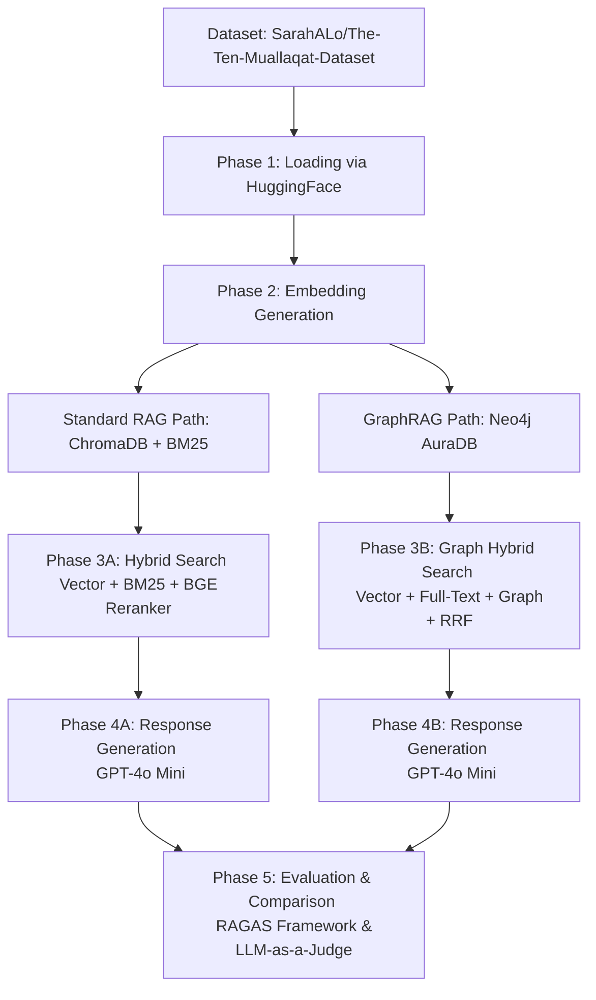

# 📜 Shura7 Al-Sh3er (شُرّاح الشعر) — Arabic Poetry Expert System

An advanced Arabic Natural Language Processing (NLP) system specialized in analyzing, explaining, and parsing (**إعراب**) the **Ten Arabic Mu'allaqat** using two RAG architectures:

- **Standard RAG (Hybrid Vector & BM25 with Reranker)**
- **Hybrid GraphRAG (Knowledge Graph-based with RRF)**

---

## 👥 Developers

* **Haya Alwizrah** ([Haya-Alwizrah](https://github.com/Haya-Alwizrah))
* **Sarah ALowjan** ([SarahALo](https://github.com/SarahALo))

---

## 🏗️ Project Architecture

The system follows a complete pipeline starting from dataset loading and embedding generation, to database storage, retrieval, response generation, and evaluation.



---

## 🛠️ Technical Stack

* **Large Language Model (LLM):** OpenAI `gpt-4o-mini` for contextual answer generation and evaluation.
* **Embedding Models:** `Sarah0001/Arabic_embed_model` and `Omartificial-Intelligence-Space/Arabic-Triplet-Matryoshka-V2` for semantic understanding.
* **Retrieval & Reranking:** `BAAI/bge-reranker-base` (CrossEncoder) and `BM25Okapi` for lexical search.
* **Databases:**
* **ChromaDB:** Vector database for semantic search.
* **Neo4j AuraDB:** Graph database for storing grammatical, semantic, and vocabulary relationships.


* **Frameworks & Tools:** Streamlit, LangChain, Datasets, RAGAS, `sentence-transformers`, and `rank-bm25`.

---

## ⬡ Neo4j Graph Data Schema

Data is stored in Neo4j using a relational graph structure that separates poetry information into connected nodes to improve retrieval quality and search accuracy.

### Relationships

* **`(Poet)`** `-[:WROTE]->` **`(Verse)`**
* **`(Verse)`** `-[:HAS_MEANING]->` **`(Meaning)`**
* **`(Verse)`** `-[:HAS_GRAMMAR]->` **`(Grammar)`**
* **`(Verse)`** `-[:HAS_VOCABULARY]->` **`(Vocabulary)`**

```cypher
// Graph Node Creation Script

MERGE (p:Poet {name: $poet})

MERGE (v:Verse {
    poet: $poet,
    verse_number: $verse_number
})

SET v.text = $verse

MERGE (m:Meaning {
    id: $verse_number,
    text: $meaning
})

MERGE (g:Grammar {
    text: $grammar
})

MERGE (vo:Vocabulary {
    text: $vocabulary
})

MERGE (p)-[:WROTE]->(v)

MERGE (v)-[:HAS_MEANING]->(m)

MERGE (v)-[:HAS_GRAMMAR]->(g)

MERGE (v)-[:HAS_VOCABULARY]->(vo)

SET v.embedding = $embedding


```

---

## 🔍 GraphRAG Hybrid Search & Reranking Strategy

The **GraphRAG** pipeline uses a hybrid retrieval system combined with custom reranking to improve answer quality and relevance.

### Retrieval Steps

1. **Vector Search** Queries the `verse_vector` index using semantic similarity between embeddings.
2. **Full-Text Search** Queries the `verse_text` index to retrieve exact keyword matches from classical Arabic poetry.
3. **Graph Search** Uses the graph structure to retrieve connected meaning, grammar, and vocabulary nodes.
4. **Weighted RRF Reranking** Combines results from all retrieval methods using Reciprocal Rank Fusion (RRF) and reranks them using custom weights:

* Vector Search → `1.0`
* Keyword Search → `1.2`
* Graph Search → `1.2`

The final top-ranked contexts are then passed to the LLM for answer generation using strict anti-hallucination system prompts.

---

## 📚 Dataset & Literary Sources

The project uses a custom manually curated dataset based on the reference book:

> **كتاب فتح الكبير المتعال إعراب المعلقات العشر الطوال**

### Sources

* Digital Reference:
[فتح الكبير المتعال إعراب المعلقات العشر الطوال](https://shamela.ws/book/151017)
* HuggingFace Dataset:
[SarahALo/The-Ten-Muallaqat-Dataset](https://huggingface.co/datasets/SarahALo/The-Ten-Muallaqat-Dataset)

The dataset contains contextual explanations, vocabulary meanings, and grammatical parsing for all:

## **10 Major Arabic Mu'allaqat (المعلقات العشر الكبرى)**

1. **معلقة امرئ القيس** (*قفا نبك من ذكرى حبيب ومنزل*)
2. **معلقة طرفة بن العبد** (*لخولة أطلال ببرقة ثهمد*)
3. **معلقة زهير بن أبي سلمى** (*أمن أم أوفى دمنة لم تكلم*)
4. **معلقة لبيد بن ربيعة** (*عفت الديار محلها فمقامها*)
5. **معلقة عمرو بن كلثوم** (*ألا هبي بصحنك فاصبحينا*)
6. **معلقة عنترة بن شداد** (*هل غادر الشعراء من متردم*)
7. **معلقة الحارث بن حلزة** (*آذنتنا ببينها أسماء*)
8. **معلقة الأعشى** (*ودع هريرة إن الركب مرتحل*)
9. **معلقة النابغة الذبياني** (*يا دار مية بالعلياء فالسند*)
10. **معلقة عبيد بن الأبرص** (*أقفر من أهله ملحوب*)

---

## 📊 Evaluation Metrics

### 1. RAGAS Framework (Statistical Metrics)

The system evaluates both RAG architectures using automated evaluation metrics.

* **Faithfulness:** Checks whether the generated answer is supported by the retrieved context.
* **Answer Relevancy:** Measures how relevant the answer is to the user's question.
* **Context Precision:** Evaluates how accurately the retrieved contexts match the query.
* **Context Recall:** Measures how much useful information was successfully retrieved.

---

### 2. LLM as a Judge (Qualitative Evaluation)

A secondary `gpt-4o-mini` model acts as an evaluation judge for generated responses.

### Evaluation Criteria

* Accuracy
* Context Adherence
* Question Relevance

### Features

* JSON-based structured evaluation output
* Automatic comparison between Standard RAG and GraphRAG
* Performance comparison charts and downloadable CSV reports inside the Streamlit dashboard

---

## 🚀 Getting Started

### 1. Install Dependencies

```bash
pip install -r requirements.txt

```

---

### 2. Configure Environment Variables (`.env`)

Create a `.env` file in the project root:

```env
OPENAI_API_KEY="your-openai-api-key"

OPENAI_MODEL="gpt-4o-mini"

EMBEDDING_MODEL="Sarah0001/Arabic_embed_model"
EMBEDDING_MODEL2="Omartificial-Intelligence-Space/Arabic-Triplet-Matryoshka-V2"

DATASET="SarahALo/The-Ten-Muallaqat-Dataset"

NEO4J_URI="neo4j+s://your-instance.databases.neo4j.io"

NEO4J_USERNAME="your-neo4j-username"

NEO4J_PASSWORD="your-neo4j-password"


```

---

### 3. Initialize the Databases

Run:

```bash
python src/PoetryGraphPipeline.py

```

This indexes the HuggingFace dataset into Neo4j AuraDB.

ChromaDB is initialized automatically during runtime.

---

### 4. Run the Streamlit Dashboard

```bash
streamlit run app2.py

```
